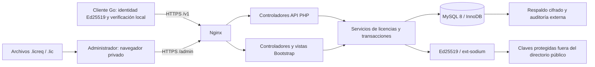

# Arquitectura del servidor AIBID

Estado: diseño completo por etapas; panel y persistencia administrativa implementados en etapa 2; activaciones y firma JWS online implementadas en etapa 3. Offline, integración del cliente real y operación VPS continúan pendientes. Contrato de referencia: [V1.0](LICENSE_CONTRACT.md). Registro de decisiones: [DECISIONS.md](DECISIONS.md).

## 1. Límites del sistema

Aplicación PHP modular, desplegada en un único VPS Ubuntu con Nginx, PHP-FPM y MySQL 8/InnoDB. API y panel comparten servicios de negocio y transacciones. No necesitan un proceso PHP residente, una cola, Redis ni un instalador de escritorio. Las tareas periódicas de mantenimiento podrán ejecutarse con cron o timers del sistema.

El servidor administra clientes, productos, derechos, activaciones, revisiones, mantenimiento y auditoría. El cliente Go aplica los derechos sobre sus operaciones documentales; React presenta su estado. No se almacenan bibliotecas, documentos, rutas de disco, OCR ni usuarios finales del gestor. No se comparten bases de datos.



`/v1` autentica instalaciones mediante proof; `/admin` tiene restricción de red configurable además de sesión, roles y MFA. Las restricciones del panel no deben impedir la activación de clientes externos. Solo `public/` será raíz web.

## 2. Organización objetivo

```text
public/                 index.php y assets estáticos propios
src/Http/Api/           controladores y validadores del contrato V1
src/Http/Admin/         controladores, sesión, CSRF y autorización
src/Application/       casos de uso y límites de transacción
src/Domain/            reglas de licencias, capacidades y vigencias
src/Infrastructure/    repositorios PDO, Sodium, reloj y auditoría
templates/             vistas PHP con Bootstrap 5
assets/                JavaScript y estilos fuente legibles
config/                configuración sin secretos reales
database/migrations/   migraciones versionadas y datos iniciales
bin/                   bootstrap administrativo y tareas operativas
tests/                 unidades, integración, contrato y panel
contracts/v1/fixtures/ vectores públicos exclusivamente de prueba
```

Servicios principales: `IssueLicense`, `ChangeLicenseEntitlements`, `RenewSubscription`, `PurchaseMaintenance`, `ActivateInstallation`, `RefreshActivation`, `DeactivateInstallation`, `ImportOfflineRequest`, `ApproveOfflineRequest`, `TransferLicense`, `RevokeLicense`. Las rutas del panel y de API llaman a los mismos casos de uso. La validación HTTP no sustituye las invariantes del dominio.

`LicenseSigner`, `InstallationProofVerifier`, `OfflineRequestVerifier`, `Clock`, `TransactionManager` y repositorios tendrán interfaces pequeñas. El reloj inyectable permite probar límites temporales sin esperas. Se usará Composer para autoload y dependencias justificadas; no se elegirá una biblioteca de MFA sin evaluar mantenimiento, licencia y pruebas al implementarla. La criptografía Ed25519 utiliza Sodium directamente.

## 3. Entidades y fuentes de verdad

| Concepto | Responsabilidad |
| --- | --- |
| Licencia comercial | Producto, cliente, modalidad, derechos, estado comercial y contador de revisiones |
| Credencial comercial | Secreto de alta entropía utilizado exclusivamente para activar |
| Activación | Identidad de una instalación autorizada, huella y estado de ocupación de plaza |
| Revisión | Instantánea inmutable del payload y del JWS emitido para una activación |
| Periodo de suscripción | Operación comercial que establece o extiende `expires_at` explícitamente |
| Mantenimiento | Compra opcional independiente para una perpetua |
| Solicitud | Idempotencia y resultado de una operación online u offline |
| Auditoría | Quién autorizó el cambio, motivo y referencias a sus resultados |

Una licencia recién emitida puede no tener activación; aún no es posible generar su payload V1, que exige identidad y `activation_id`. Se guarda el derecho comercial y se muestra la clave una sola vez. Al activarse, se emite la primera revisión firmada. Los cambios comerciales sin activación se auditan y se incorporan al siguiente JWS; no se inventa una identidad de instalación para firmarlos.

Cada emisión de un nuevo JWS toma el siguiente contador global de su licencia bajo bloqueo. El cliente compara revisiones dentro de cada `activation_id`. Se permiten saltos y nunca se reutiliza un número. `refresh` sin cambios devuelve el JWS vigente sin elevar el contador; una renovación, cambio de módulos, mantenimiento o revocación genera una revisión nueva. Un reintento idempotente devuelve los mismos bytes de la respuesta original.

## 4. Estados y transiciones

| Objeto | Estados internos | Transiciones admitidas |
| --- | --- | --- |
| Licencia | `issued`, `revoked` | Emisión → `issued`; revocación comercial → `revoked`. Rehabilitación fuera de V1 del panel inicial |
| Activación | `active`, `deactivated`, `revoked`, `transferred` | Creación → `active`; salida irreversible de esa activación por desactivación, revocación o transferencia |
| Solicitud offline | `pending`, `approved`, `rejected` | Importación verificada → `pending`; decisión administrativa → estado terminal |
| Desafío | disponible, consumido, vencido | Disponible → consumido tras prueba válida; vencimiento derivado de su instante límite |
| Clave firmante | `staged`, `signing`, `verify_only`, `compromised` | Preparación → firma → solo verificación; incidente → comprometida |

Los estados internos no se agregan al JSON firmado. `license_status` solo toma `active` o `revoked`. Una suscripción vencida mantiene su activación y ocupa la plaza; vencer no autoriza otra instalación. Un producto archivado deja de venderse pero conserva la verificación y el refresh de licencias anteriores.

| Estado derivado en el cliente | Condición | Comportamiento del cliente |
| --- | --- | --- |
| Sin activar | No existe JWS válido aceptado | Asistente y recuperación/exportación administrativa segura |
| Inválida | Firma, producto, identidad o contenido inválidos | Recuperación sin escrituras documentales |
| Revocada | JWS autenticado `revoked` | Consulta, visualización, descarga y respaldo |
| Perpetua activa | JWS `active`, `expires_at:null`, `grace_days:0` | Uso indefinido de versiones autorizadas |
| Suscripción activa | `now < expires_at` | Operación normal |
| Tolerancia | `expires_at <= now < expires_at + 1296000 segundos` | Operación normal y aviso al administrador |
| Vencida | `now >= expires_at + 1296000 segundos` | Solo lectura y exportación |

Primero se valida la autenticidad y la identidad, después la revisión y el estado, luego el tiempo y las capacidades. Un error de red no equivale a revocación. El servidor no puede garantizar el reloj ni el borrado de una copia desconectada.

## 5. Flujos y atomicidad

```mermaid
sequenceDiagram
    participant C as Cliente Go
    participant A as API PHP
    participant D as MySQL
    C->>A: POST challenge, action=activate
    A->>D: Registrar desafío con caducidad
    A-->>C: challenge_id, nonce, expires_at
    C->>C: Firmar proof exacto V1
    C->>A: POST activations con request_id y proof
    A->>A: Validar JSON, límites y prueba de posesión
    A->>D: BEGIN; reservar request_id; bloquear desafío y licencia
    A->>D: Comprobar identidad, estado y plaza; consumir desafío
    A->>D: Crear activación y reservar revisión
    A->>A: Firmar JWS con Sodium
    A->>D: Guardar JWS, respuesta y auditoría; COMMIT
    A-->>C: license_jws, server_time, request_id
```

Si la firma, persistencia o auditoría falla, se revierte la transacción completa. Nunca se responde con un JWS que no quedó confirmado. Si la respuesta se pierde después del commit, el reintento recupera el resultado por `request_id`. El orden detallado de bloqueos y errores está en [SCHEMA.md](SCHEMA.md).

Offline: importar `.licreq` → comprobar firma y formato → guardar pendiente → mostrar identidad y licencia propuesta → decisión administrativa con motivo → volver a comprobar derechos y plaza bajo bloqueo → emitir y archivar `.lic`. Importar no concede derechos. La renovación conserva licencia/activación e incrementa revisión; no renueva automáticamente por el mero hecho de importar una solicitud. La fecha comercial se selecciona explícitamente.

Transferencia: el superadministrador identifica la activación saliente y el motivo, revoca su autorización y libera la plaza en una transacción. Si se dispone de una solicitud válida del nuevo equipo, puede autorizarse dentro de esa misma operación; de lo contrario, la licencia queda sin plaza ocupada hasta una activación posterior. Nunca se reutiliza el `activation_id` anterior ni se copian su clave o huella al equipo entrante. Véase la interpretación aceptada B-01 para entregar al equipo retirado su resultado firmado.

## 6. Reglas comerciales

- `gestor_documental` es el identificador inicial estable. El catálogo admite productos nuevos sin cambiar el servicio de firma.
- Una perpetua se crea con `expires_at:null`, `grace_days:0`, `maintenance_until:null`. Su corte de versiones se registra explícitamente al venderla. No hay cortesía ni seis meses incluidos.
- Mantenimiento requiere una operación de compra separada y auditada; extiende `maintenance_until` y `entitled_release_until` sin limitar el uso de versiones ya adquiridas.
- Suscripción: fecha de vencimiento obligatoria, `grace_days:15`, mantenimiento nulo. El corte de versiones propuesto coincide con el vencimiento contratado. La tolerancia no extiende ese corte.
- Renovar establece un nuevo vencimiento explícito superior al anterior; la UI de etapa 2 permite introducir explícitamente el instante UTC final. No hay cobro ni renovación automática.
- `review_workflow` requiere `expedientes`. Cargar documentos a expedientes requiere también `managed_libraries`; esa condición se comprueba en la operación del cliente. No se convierte unilateralmente en una dependencia general `expedientes → managed_libraries`.
- El modo híbrido es `linked_libraries:true` y `managed_libraries:true`. No existe `hybrid` en el catálogo, el payload ni el cobro.
- `limits`: una instalación y los otros tres límites nulos para el primer producto. La extensibilidad no habilita múltiples plazas en esta implementación.
- Reducir módulos o derechos genera revisión y conserva datos; los controles de consulta/exportación pertenecen al cliente Go.

## 7. Panel administrativo

| Pantalla | Datos y operaciones |
| --- | --- |
| Acceso | Login, segundo factor, recuperación de acceso; sin registro público |
| Resumen | Licencias por vencer, solicitudes pendientes, incidentes operativos sin secretos |
| Clientes | Cliente, contactos mínimos y licencias relacionadas |
| Productos | `product_id` inmutable, nombre, capacidades y dependencias; archivado sin eliminación histórica |
| Emisión | Cliente, producto, modalidad, módulos y vigencia; mantenimiento separado y desmarcado |
| Detalle de licencia | Derechos, plaza actual, revisiones, periodos, mantenimiento e historial |
| Operaciones offline | Importación, resultado de verificación, asignación, aprobación/rechazo y exportación |
| Transferencia/revocación | Identidad afectada, efectos, motivo obligatorio y reautenticación |
| Seguridad | Administradores, roles, MFA y metadatos públicos de claves |
| Auditoría | Consulta y filtros; sin botones de edición ni borrado |

Listados con filtros por cliente, producto, estado y vencimiento; paginación en servidor. La interfaz de etapa 2 muestra y recibe fechas en UTC. La clave comercial solo aparece al emitir; no se recupera desde el detalle. Las descargas `.lic` requieren sesión y permiso, sin enlaces públicos permanentes. Los archivos importados nunca se sirven directamente.

| Acción | Superadministrador | Operador de licencias | Consulta |
| --- | --- | --- | --- |
| Consultar clientes, derechos e historial | Sí | Sí | Sí |
| Emitir/renovar, módulos, mantenimiento, clientes | Sí | Sí | No |
| Importar y aprobar activación/renovación offline | Sí | Sí | No |
| Desactivar con solicitud válida | Sí | Sí | No |
| Forzar transferencia o revocar comercialmente | Sí | No | No |
| Administrar productos/catálogos, usuarios o claves | Sí | No | No |
| Exportar `.lic` | Sí | Sí | No |

Se verifica autorización en cada controlador y caso de uso. Ocultar una acción en la vista no concede protección. MFA TOTP está implementado desde el bootstrap de etapa 2; el restablecimiento de MFA se realiza por CLI y queda auditado.

## 8. Implementación de etapa 3

`Http/ApiKernel` atiende las cuatro rutas del contrato antes de cargar sesiones administrativas. `ActivationService` valida proofs y administra desafíos/idempotencia; `RevisionPublisher` publica derechos y `SigningKeys` obtiene la clave del propósito/entorno correcto. Las operaciones comparten PDO y el mismo commit de activación, contador, JWS, respuesta y auditoría. La transacción puede reintentarse dos veces únicamente ante deadlock/timeout conocido después de rollback completo; una pérdida de conexión durante commit no se presume fallida.

`LicenseService` llama al publicador al cambiar módulos, renovar, comprar mantenimiento o revocar una licencia con instalación activa. Guardar módulos idénticos y reemplazar una credencial comercial no crea otra firma. Las activaciones terminadas conservan su revisión terminal; una renovación posterior no vuelve a autorizar equipos retirados.

El panel añade instalación activa/histórica y las últimas 50 revisiones descargables. La descarga requiere rol superadministrador u operador y entrega los bytes JWS archivados, sin regenerarlos ni crear una activación. La aprobación de solicitudes offline y transferencia forzada todavía no están disponibles.
