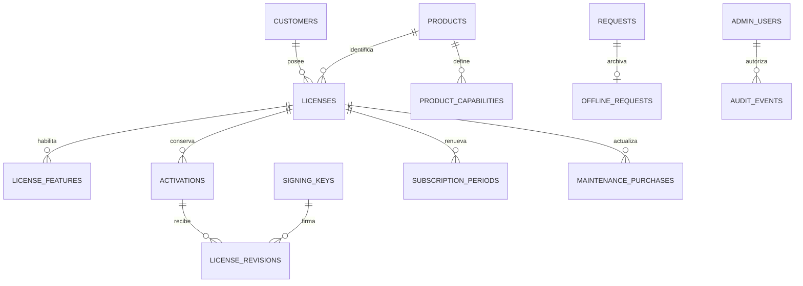

# Modelo de datos y transacciones

Estado: esquema lógico completo por etapas. Las migraciones administrativas `001_administration.sql` y `002_aibid_catalog.sql` ya están ejecutadas y verificadas en MySQL 8.4.11/InnoDB. La migración 003 añade activaciones, firma e idempotencia online; la 004 añade evidencia offline, decisiones y transferencias. Las secciones 10–12 describen el esquema físico vigente; las primeras secciones conservan el modelo conceptual. MariaDB de XAMPP no sustituye este motor.

## 1. Convenciones

UUID externos como cadenas; almacenamiento `BINARY(16)` mediante conversión explícita y reversible, sin depender de orden temporal. `installation_id` debe ser UUIDv4. Los demás UUID del contrato no se restringen a v4 al recibirlos; el servidor genera UUIDv4 criptográficamente aleatorios. Identificadores de protocolo y `kid` usan comparación binaria sensible a mayúsculas; nombres humanos usan `utf8mb4`.

Instantes en `DATETIME(6)` UTC; la conexión fija `time_zone='+00:00'`. Salida propia en RFC 3339 con `Z`; nunca guardar fechas locales. Claves públicas `BINARY(32)`, hashes SHA-256/HMAC-SHA-256 `BINARY(32)`, firmas Ed25519 de 64 bytes. `fingerprint_version` es la cadena `"1"` en el contrato; el hash se almacena como 32 bytes y se serializa con `sha256:` y hexadecimal minúsculo.

Los estados internos usan `VARCHAR` y `CHECK` con valores cerrados. FKs con `RESTRICT` en la historia comercial; no hacer borrados en cascada de licencias, activaciones, revisiones o auditoría. Los JSON conservan tipos: booleanos reales, enteros y nulos, sin convertirlos en cadenas. PDO empleará excepciones, consultas preparadas nativas y parámetros, sin interpolar filtros ni ordenamientos no permitidos.

## 2. Entidades

Los campos siguientes son los esenciales del diseño; las migraciones agregarán PK, FK, nulabilidad, índices y metadatos de creación indicados. Los campos internos no se incorporan al payload V1.

| Tabla | Campos esenciales | Restricciones e índices |
| --- | --- | --- |
| `customers` | `id`, `display_name`, `legal_name?`, `status`, timestamps | Estado activo/archivado; índice por nombre |
| `customer_contacts` | `id`, `customer_id`, `name`, `email?`, `phone?` | FK cliente; retener solo datos necesarios |
| `products` | `product_id`, `display_name`, `status`, timestamps | PK técnica inmutable; archivado sin romper licencias previas |
| `product_capabilities` | `product_id`, `capability_key`, `display_name`, `status` | PK compuesta; claves estables, sin borrar capacidades emitidas |
| `capability_dependencies` | `product_id`, `capability_key`, `required_key` | PK triple; ambas FKs al mismo catálogo; prohibir ciclos en servicio |
| `licenses` | `license_id`, `customer_id`, `product_id`, `license_type`, `commercial_status`, `expires_at?`, `grace_days`, `maintenance_until?`, `entitled_release_until`, `revision_counter`, timestamps | FK cliente/producto; checks comerciales; índices cliente, producto/estado y vencimiento |
| `license_credentials` | `credential_id`, `license_id`, `key_digest`, `digest_key_version`, `state`, `created_at`, `retired_at?` | `UNIQUE(digest_key_version,key_digest)`; una credencial habilitada por licencia mediante columna generada única |
| `license_features` | `license_id`, `product_id`, `capability_key`, `enabled` | PK licencia/capacidad; FKs compuestas a licencia/producto y catálogo; no permitir módulos de otro producto |
| `license_limits` | `license_id`, `max_installations`, `max_users?`, `max_libraries?`, `max_documents?` | PK/FK licencia; una instalación; límites opcionales positivos o nulos |
| `subscription_periods` | `id`, `license_id`, `previous_expires_at?`, `new_expires_at`, `effective_at`, `commercial_reference?`, `admin_id`, `reason` | Registro inmutable; licencia de suscripción validada en servicio |
| `maintenance_purchases` | `id`, `license_id`, `previous_until?`, `new_until`, `purchased_at`, `commercial_reference?`, `admin_id`, `reason` | Compra independiente e inmutable; solo perpetua |
| `activations` | `activation_id`, `license_id`, `product_id`, `installation_id`, `installation_public_key`, `fingerprint_version`, `fingerprint_hash`, `state`, `activated_at`, `ended_at?`, `latest_revision_id?` | FK compuesta licencia/producto; índice único de plaza activa; índices instalación e historial de licencia |
| `license_revisions` | `id`, `license_id`, `activation_id`, `revision_number`, `kid`, `issued_at`, `payload_bytes`, `license_jws`, `jws_sha256`, `cause`, `request_id?` | `UNIQUE(license_id,revision_number)`; FK compuesta activación/licencia; inmutable |
| `signing_keys` | `kid`, `environment`, `purpose`, `public_key`, `secret_reference`, `state`, `created_at`, `activated_at?`, `retired_at?` | PK `kid`; una clave `signing` por propósito/entorno; sin privada en claro |
| `activation_challenges` | `challenge_id`, `action`, `product_id`, `installation_id`, `activation_id?`, `nonce`, `created_at`, `expires_at`, `consumed_at?`, `consumed_request_id?` | PK; índice por vencimiento; identidad de desafío inmutable |
| `requests` | `product_id`, `request_id`, `channel`, `action`, `request_digest`, `digest_key_version`, `actor_binding`, `authentication_evidence`, `state`, `http_status?`, `response_bytes?`, `license_id?`, `activation_id?`, timestamps | PK producto/request; resultado terminal inmutable; `actor_binding` incluye identidad y hash de pública; evidencia conserva desafío/proof sin clave comercial |
| `offline_requests` | `id`, `product_id`, `request_id`, `evidence_encrypted`, `encryption_version`, `projection_json`, `imported_at`, `imported_by` | UNIQUE/FK producto/request a `license_requests`; evidencia inmutable |
| `offline_decisions` | `offline_id`, `decision`, `license_id?`, `revision_id?`, `admin_id`, `reason`, `decided_at` | Una decisión inmutable por solicitud; aprobación exige licencia/revisión |
| `license_transfers` | `id`, `license_id`, `outgoing_activation_id`, `incoming_activation_id?`, `admin_id`, `reason`, `offline_limit_accepted`, `created_at` | FKs a la misma licencia; origen único; registro inmutable |
| `admin_users` | `id`, `login`, `password_hash`, `role`, `state`, `mfa_secret_encrypted?`, `last_totp_step?`, timestamps | Login único; Argon2id; roles cerrados; secretos cifrados |
| `admin_recovery_codes` | `id`, `admin_id`, `code_hash`, `used_at?` | Código de un uso con consumo atómico |
| `admin_sessions` | `token_hash`, `admin_id`, `mfa_verified_at?`, `created_at`, `last_seen_at`, `expires_at`, `revoked_at?` | PK hash de token; sin token de sesión en claro |
| `admin_operations` | `operation_id`, `admin_id`, `action`, `input_digest`, `state`, `result_reference`, timestamps | Unicidad por operación de formulario para evitar doble renovación; separada del contrato de API |
| `rate_limit_buckets` | `scope`, `key_digest`, `window_start`, `count`, `expires_at` | PK scope/clave/ventana; incrementos atómicos; expurgo temporal |
| `audit_heads` | `stream_id`, `last_sequence`, `last_event_hash` | Una fila por entorno para serializar el encadenamiento |
| `audit_events` | `sequence`, `event_id`, `occurred_at`, `actor_type`, `actor_id?`, `operation`, `target_type`, `target_id?`, `request_id?`, `reason?`, `metadata_json`, `previous_hash`, `event_hash`, `hmac_key_version` | Secuencia única; app solo SELECT/INSERT; índices actor, objeto, request y fecha |

`latest_revision_id` debe apuntar a una revisión de esa misma activación; usar FK compuesta con `(activation_id, id)` en revisiones. Se agrega tras crear ambas tablas. Los bytes firmados se conservan en `MEDIUMBLOB`, además de proyecciones consultables si hacen falta; no reconstruir un JWS histórico desde columnas actuales o JSON normalizado por MySQL.

Los desafíos no tienen FK obligatoria a activaciones: se pueden crear para identidades desconocidas sin revelar si existen; la autenticación se resuelve en el endpoint final. Producto desconocido recibe tratamiento genérico. La solicitud offline almacena únicamente identidad de licencia y operación, nunca archivos documentales del gestor.

Los originales `.licreq` se archivan con cifrado autenticado y clave de evidencia separada, preservando sus bytes para verificar sin guardar en claro campos opcionales sensibles. No duplicar `payload_b64u` en columnas abiertas: codificar no cifra. Las proyecciones para consulta incluyen solo los campos de identidad autorizados. El hash/HMAC de la credencial comercial sigue siendo su única representación en el modelo de credenciales.

## 3. Relaciones principales



## 4. Invariantes de base de datos

Fragmentos previstos sobre tablas ya creadas; se convertirán en migraciones completas con sus columnas y FKs durante la implementación:

```sql
ALTER TABLE activations
    ADD COLUMN active_license_id BINARY(16)
        GENERATED ALWAYS AS (
            CASE WHEN state = 'active' THEN license_id ELSE NULL END
        ) STORED,
    ADD UNIQUE KEY uq_one_active_activation (active_license_id),
    ADD UNIQUE KEY uq_activation_license (activation_id, license_id),
    ADD CONSTRAINT chk_activation_end CHECK (
        (state = 'active' AND ended_at IS NULL)
        OR (state IN ('deactivated', 'revoked')
            AND ended_at IS NOT NULL)
    );

ALTER TABLE licenses
    ADD UNIQUE KEY uq_license_product (license_id, product_id),
    ADD CONSTRAINT chk_license_terms CHECK (
        (license_type = 'perpetual' AND expires_at IS NULL AND grace_days = 0)
        OR (license_type = 'subscription' AND expires_at IS NOT NULL
            AND grace_days = 15 AND maintenance_until IS NULL)
    );

ALTER TABLE license_limits
    ADD CONSTRAINT chk_single_installation CHECK (max_installations = 1),
    ADD CONSTRAINT chk_user_limit CHECK (max_users IS NULL OR max_users > 0),
    ADD CONSTRAINT chk_library_limit CHECK (max_libraries IS NULL OR max_libraries > 0),
    ADD CONSTRAINT chk_document_limit CHECK (max_documents IS NULL OR max_documents > 0);
```

`state`, `license_type`, `grace_days`, `max_installations` y los identificadores relacionados son `NOT NULL`; de lo contrario, la lógica de tres valores de SQL puede debilitar los checks. El servicio aplica además los tres límites nulos del primer producto y las reglas entre filas, como compra explícita de mantenimiento, dependencias de capacidades y ausencia de ciclos.

Un índice único permite múltiples valores `NULL`, por lo que las activaciones terminadas no colisionan y la segunda activa sí falla. Esta restricción protege incluso si un futuro camino de código omite el chequeo previo. [MySQL: índices únicos](https://dev.mysql.com/doc/refman/8.0/en/create-index.html). Los checks son otra defensa para expresiones de una fila; no reemplazan las reglas entre entidades. [MySQL: CHECK](https://dev.mysql.com/doc/refman/8.4/en/create-table-check-constraints.html).

## 5. Orden de bloqueos

Orden objetivo de las transacciones del protocolo. En etapa 2 se comprueba primero el actor bajo bloqueo compartido; después la idempotencia administrativa, el cliente cuando se emite, el producto y luego la licencia. Las modificaciones de dependencias bloquean el producto antes de sus licencias. La cabeza de auditoría siempre se toma al final.

Dentro de las transacciones online y offline implementadas:

1. Fila de idempotencia: `requests` para API/offline o `admin_operations` para panel. Si una operación administrativa decide una solicitud offline, bloquear primero su `admin_operations` y después `requests`; ningún flujo invierte esa relación.
2. Desafío, cuando corresponde.
3. Producto bajo bloqueo compartido, seguido de licencia comercial mediante `SELECT ... FOR UPDATE` por PK.
4. Activación(es) por PK en orden binario, derechos y periodos asociados.
5. Evidencia/decisión offline: se insertan bajo la reserva de `license_requests` ya bloqueada; la evidencia original no admite UPDATE.
6. Ámbito y clave firmante con bloqueo compartido durante la emisión; rotación no bloquea licencias. En una transferencia se retira el origen antes de insertar el destino, manteniendo el mutex de la licencia durante ambas firmas.
7. Cabeza de auditoría, al final, antes de agregar evento y confirmar.

Una consulta inicial sin bloqueo puede localizar la licencia; toda autorización y condición mutable se vuelve a leer bajo los bloqueos anteriores. No hacer HTTP, correos ni llamadas a terceros dentro de la transacción. La firma es local. Todos los cambios administrativos de derechos bloquean también la licencia.

Se usa `READ COMMITTED` con bloqueos explícitos e índice único; no depender de que una lectura de una plaza vacía bloquee otra inserción. El mutex es la fila de licencia, que sí existe. `FOR UPDATE` se usa dentro de transacciones explícitas. [MySQL: locking reads](https://dev.mysql.com/doc/refman/8.0/en/innodb-locking-reads.html).

## 6. Activación e idempotencia online

1. Aplicar límite de tamaño/tasa, parsear con rechazo de claves JSON duplicadas y validar tipos.
2. Localizar el desafío y construir exactamente el mensaje de prueba; comprobar firma sin modificar datos. La revalidación definitiva de estado/caducidad ocurre bajo bloqueo. Para un reintento, autenticar contra la identidad archivada.
3. Calcular un digest interno con HMAC de ruta/acción, producto y todos los campos tipados, incluida la clave comercial si existe. Guardar la versión del secreto de digest. Usar una serialización interna estable; no es una firma ni un requisito nuevo para el cliente.
4. `BEGIN`; intentar insertar `requests` con su PK compuesta. Una colisión concurrente espera al commit/rollback de la primera transacción. Leer la fila existente bajo bloqueo; misma identidad/digest y resultado terminal → respuesta original; otro contenido → `INVALID_REQUEST` HTTP 409. No sobreescribirla.
5. Si es nueva, bloquear desafío, licencia y activación según el orden anterior. Validar acción, identidad, pública vinculada, `now < expires_at`, ausencia de consumo, clave comercial y derechos. Volver a comprobar la firma si cambió algún dato obtenido fuera del bloqueo.
6. Con prueba válida, marcar el desafío consumido por ese request. Si la licencia está revocada o la plaza ocupada, guardar el error comercial terminal y confirmar el consumo junto al resultado. Una prueba inválida no consume un desafío legítimo.
7. Si hay plaza, insertar `activations`; elevar contador; formar payload; seleccionar y bloquear metadatos del firmante; firmar; guardar revisión, respuesta exacta y auditoría.
8. `COMMIT`, después enviar respuesta. Una excepción técnica provoca rollback completo y `TEMPORARY_UNAVAILABLE`; no archivar un éxito provisional.

Las condiciones de negocio negativas solo se detallan después de autenticar. La inexistencia/clave incorrecta produce un mensaje uniforme; no se reserva un request para JSON o proof inválidos. Un resultado terminal autenticado queda idempotente aunque el estado comercial cambie después; para una operación nueva se exige otro `request_id` y otro desafío.

La autenticación del reintento verifica la prueba y compara el digest y la identidad archivados antes de devolver bytes. No exige que un desafío ya consumido siga vigente ni que la credencial comercial siga habilitada: ya no ejecuta un cambio. Se conserva evidencia del desafío/proof de solicitudes confirmadas dentro del registro interno protegido para esa comprobación, aunque se expurguen desafíos no usados.

Si llegan dos activaciones con distintos requests, la segunda espera la fila de licencia y observa la plaza ocupada. El índice único es la defensa final. Si llegan dos con el mismo request, la segunda recibe el mismo resultado. Un request nuevo de la misma instalación tampoco crea una segunda activación: recibe `ACTIVATION_LIMIT`; debe reutilizar el request original o usar refresh si conserva su activación.

Las operaciones online realizan hasta dos reintentos internos ante deadlock/timeout después de rollback completo y nueva lectura. Las operaciones administrativas revierten y devuelven 503 sin reintento interno; el mismo `operation_id` permite reintentar sin duplicar el efecto. Una pérdida de conexión durante commit tiene resultado desconocido: el siguiente intento consulta `request_id`, nunca presupone que el commit falló.

## 7. Cambios, refresh y flujos offline

- **Refresh:** autenticar pública guardada, no la comercial; bloquear licencia y activación. Entregar la revisión actual, incluso si está revocada. Nunca actualizar identidad desde el request. Un cambio administrativo concurrente queda ordenado por el mismo bloqueo.
- **Revocación comercial:** marcar licencia revocada, cerrar activación activa, generar su revisión revocada y auditar en una transacción. Si no hay activación, solo registrar estado comercial; impedir activaciones futuras. Conservar las identidades y JWS históricos para consultas autenticadas.
- **Desactivación online:** cerrar activación y liberar índice único, registrar instante UTC y respuesta exacta. El JWS terminal para esa identidad está sujeto a B-01, sin cambiar el formato del acuse online.
- **Importación offline:** validar sobre los bytes originales antes de insertar. `requests` y `offline_requests` se crean atómicamente como pendientes. Duplicado idéntico muestra el estado existente; misma ID con contenido distinto se rechaza. La normalización de espacios del sobre externo no altera la identidad de los bytes firmados.
- **Aprobación offline:** sesión, rol, MFA, CSRF e idempotencia del formulario; bloquear solicitud y licencia; comprobar pendiente, firma, identidad y derechos actuales; ejecutar el mismo servicio de activación/renovación/desactivación; asociar revisión y decisión; commit único. Doble aprobación no vuelve a emitir ni extiende dos veces.
- **Renovación offline:** pública, producto, huella, licencia y activación deben coincidir con el vínculo existente; impedir renovación de activación terminada o licencia revocada. Mantener IDs, fijar vencimiento/corte autorizado explícito e incrementar revisión. La solicitud no contiene por sí misma autorización comercial para nuevas fechas o módulos.
- **Transferencia:** cerrar origen antes de insertar destino bajo el mismo bloqueo de licencia; si falla destino, rollback conserva origen. El modo de equipo averiado exige superadministrador, reautenticación y motivo.

Cambios de identidad requieren nueva activación mediante transferencia, nunca `UPDATE` silencioso de pública o huella. Expiración de suscripción y pérdida de mantenimiento no liberan plazas ni destruyen registros.

## 8. Historia, retención y auditoría

Revisiones, operaciones comerciales, decisiones offline y resultados idempotentes se conservan durante la vida de la licencia, incluidas perpetuas. Una política futura de archivo deberá conservar el digest, la identidad, el resultado o referencia recuperable y la prohibición de volver a ejecutar el request. No usar un TTL de 24 horas para operaciones irrevocables.

La app no recibe UPDATE/DELETE en `audit_events` ni en revisiones/periodos inmutables. `audit_heads` sí admite actualización bajo bloqueo. El evento encadena el anterior con HMAC usando un secreto separado; un anclaje periódico sale del VPS hacia almacenamiento de solo anexado bajo otra credencial. Un DBA o el compromiso conjunto de app y secretos supera estas defensas; se detecta comparando con el anclaje externo, no por una supuesta inmutabilidad absoluta.

## 9. Orden de migraciones previsto

| Entrega | Migraciones y datos iniciales | Criterio de salida |
| --- | --- | --- |
| Etapa 2 | Administradores/sesiones/MFA, auditoría, clientes, productos, capacidades, licencias, credenciales, periodos, mantenimiento e idempotencia del panel | Bootstrap sin cuenta predeterminada; roles; reglas comerciales; auditoría atómica |
| Etapa 3 | Claves, activaciones, desafíos, requests y revisiones; FKs circulares al final | Índice de plaza; firmas; reintentos y concurrencia en MySQL real |
| Etapa 4 | Solicitudes offline, decisiones inmutables y transferencias | Aprobación atómica y recuperación auditada |

La integración offline existe antes de publicar V1, aunque se construya después de la API. Las migraciones tendrán registro de versión/checksum y pruebas de instalación y actualización. Los DDL de MySQL pueden producir commits implícitos: no ofrecer un rollback ficticio de toda una migración; desplegar con preflight, respaldo y cambios compatibles progresivos.

## 10. Esquema físico disponible en etapa 2

Las migraciones de `database/migrations/` son la fuente física vigente: 20 tablas administrativas y `schema_migrations`. Incluyen `security_state` para serializar bootstrap/último superadministrador, sesiones/MFA, límites de intentos, cliente/contacto principal, catálogo, licencia/módulos/límites/credenciales, periodos, mantenimiento, historial, idempotencia y auditoría.

`customer_contacts.customer_id` es único: un contacto principal por cliente. `license_changes.snapshot_json` conserva el estado comercial y referencia de cada cambio; no es un JWS. `row_version` detecta formularios obsoletos; `revision_counter` numera los JWS publicados desde etapa 3. `audit_events.payload_json` es LONGTEXT con JSON_VALID para preservar los bytes exactos encadenados por HMAC. Las credenciales usan un HMAC versionado y una columna generada con índice único para permitir solo una credencial activa por licencia.

La etapa 3 añade las tablas de activaciones, desafíos y revisiones indicadas en la siguiente sección. El índice generado de instalación activa y el bloqueo de licencia aplican el límite de una instalación también frente a concurrencia. Los permisos por tabla se generan con `bin/grants.php` y las pruebas usan la misma cuenta restringida que usará el panel.

## 11. Migración 003 y esquema online

`003_online_activations.sql` añade seis tablas, para un total de 27 contando `schema_migrations`:

| Tabla | Responsabilidad y restricciones |
| --- | --- |
| `signing_keys` | Pública Ed25519 única, kid, entorno, propósito, estado y referencia opaca de archivo; ninguna privada en BD |
| `signing_scopes` | Una clave seleccionada por entorno/propósito; FK compuesta impide cruzarlos; bloqueo compartido durante publicación, exclusivo al rotar |
| `activations` | Identidad vinculada, huella, estado y revisión vigente; índice único generado sobre licencia solo cuando está activa |
| `license_revisions` | Contador global único por licencia, activación, kid, payload y JWS exactos; solo SELECT/INSERT para la app |
| `activation_challenges` | Nonce, acción/identidad, caducidad exclusiva y consumo atómico; sin FK de activación para responder sin enumeración |
| `license_requests` | PK producto/request, canal/acción, HMAC versionado, pública y mensaje proof, respuesta exacta y código HTTP |

La cuenta del panel/API no puede actualizar identidades de activación: sus permisos UPDATE se limitan a `state`, `ended_at` y `current_revision_id`. Una FK compuesta impide apuntar a la revisión de otra activación. La cuenta de app solo tiene SELECT sobre claves y ámbitos; la CLI usa una cuenta de gestión/migración.

La evidencia de requests confirmados permite verificar reintentos tras purgar desafíos. `cleanup.php` elimina desafíos vencidos hace más de un día, no respuestas, firmas ni resultados idempotentes. Los errores comerciales se confirman con consumo/resultado; los errores criptográficos o técnicos no dejan efectos comerciales parciales. El mensaje de proof archivado no contiene la clave comercial.

Se comprobó una actualización desde el esquema de etapa 2 con licencia, credencial, cliente e historial preexistentes. Las migraciones anteriores y el contrato literal no se modificaron.

## 12. Migración 004 y esquema offline

`004_offline_requests.sql` añade tres tablas: **30 en total**, incluida `schema_migrations`. Las migraciones 001–003 permanecen intactas. No se necesita una tabla de revocaciones adicional: la revocación comercial queda en `license_changes` y revisiones; las retiradas de activación en revisiones, solicitudes/decisiones o transferencias y auditoría.

- `offline_requests`: UUID interno, UNIQUE/FK `(product_id,request_id)`, original cifrado en `MEDIUMTEXT` ASCII, versión 1, proyección JSON sin credencial, importador/fecha. El nonce y ciphertext/tag se almacenan juntos en base64. La fecha declarada conserva su texto original en la proyección.
- `offline_decisions`: PK/FK `offline_id`, decisión, licencia/revisión, actor, motivo y fecha. Un CHECK exige licencia y revisión para `approved` y ambos nulos para `rejected`. Una segunda decisión no puede insertarse.
- `license_transfers`: origen único, destino opcional, licencia, actor/motivo/fecha y aceptación obligatoria del límite offline. FKs compuestas garantizan que origen y destino pertenecen a la misma licencia y un CHECK impide que sean iguales.

Estas tres tablas reciben solo SELECT/INSERT para la app; el preflight de producción comprueba que no tenga UPDATE/DELETE. `license_requests` sigue siendo el mutex de cada request y conserva el resultado JSON interno de la decisión. Su `proof_message` queda vacío en el canal offline: guardar allí el segmento firmado revelaría cualquier credencial opcional. El digest HMAC incluye canal, acción, versión, payload base64url exacto y firma. Producto/request ya están dentro del payload firmado. Las proyecciones no sustituyen la revalidación del original cifrado al aprobar.

Para aprobar se bloquean actor → operación administrativa → request → producto → licencia → activación → ámbito/clave de firma → auditoría. El rechazo solo bloquea actor/operación/request y auditoría porque no cambia derechos. En recuperación sin request se omite ese mutex. El índice de plaza única y la fila de licencia serializan las carreras entre API, aprobaciones y recuperación. Firma fallida, error de destino o fallo de auditoría revierten también la retirada del origen, el contador y la decisión.
